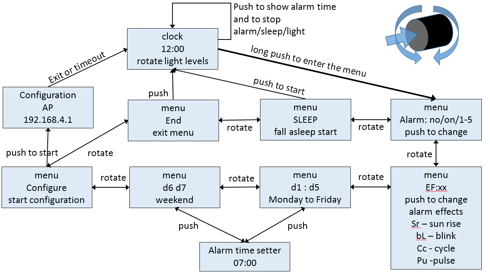

# SunriseClock

A light 'alarm' clock designed for gentle wake-up with increasing light intensity. Uses Wemos D1 mini, encoder with button, clock display with TM1637, LDR and 10 LEDs controlled as 4+3+3 blocks over 3 transistors. Everything soldered on a perfboard and put in a box.

* The esp8266 connects once a day to Internet to get time from NTP server
* To set WiFi parameters and advanced configuration [WiFiManager library](https://github.com/tzapu/WiFiManager#how-it-works) in SoftAP mode is used
* LDR is used to adjust clock display brightness according to ambient light
* Other alarm options are cycling LEDs, pulsing LEDs, full brightness of clock display, blinking clock display
* alarm on weekend is optional and has a separate alarm time setting
* if you like fall asleep with light, fade, fireplace and candles light effects are available
* the LEDs can be turned on and the intensity can be set by rotating the encoder
* the dim lighting and the fireplace or candles effect are nice not only for sleep :-)

## Images

 

 

## Some notes

* I create pictures with marks what to solder because I let the soldering to a skilled buddy
* if I would make the board again, I would put the encoder and the LDR higher and position the transistors at bottom
* the jumper wires are 10cm 'dupont' jumper wires with the black plastic replaced with heat shrink tube and then bent at the flat part of the connector
* the Wemos D1 has the CH340 on bottom side. it doesn't collide with the wires because the D1 is raised a little 
* the central LEDs are 3 yellow and one red. left and right block use 3 yellow LEDs each
* the LEDs are soldered only on the power 'rail', the other leg is only tight in the hole with the wire. this allows to aim the LEDs
* the fireplace effect has center LEDs slowly random pulsing in smaller PWM range and the left and right LEDs fast random pulsing at full PWM range. the 'fire' fades over falling asleep time.
* the candles effect uses slow random pulsing of left and right LEDs block at small PWM range
* and yes, I will buy a cable with 90° micro USB connector

